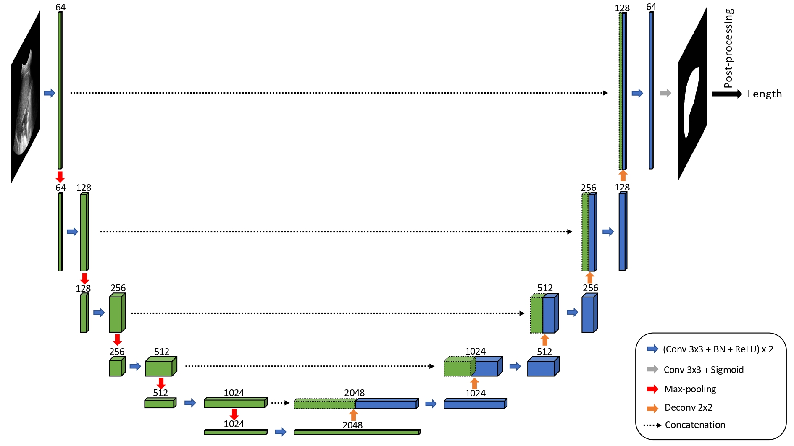
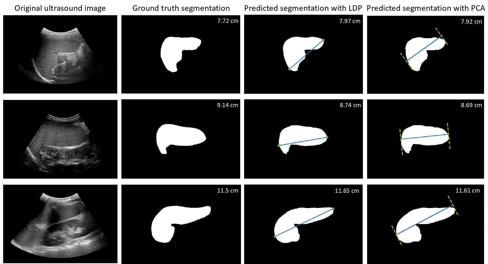

# Ultrasound Spleen Segmentation and Automated Length Measurement

This repository provides a simplified framework for **automatic spleen segmentation from ultrasound images** and subsequent **automated head-to-tail spleen length measurement**.  

In clinical practice, sonographers estimate the spleen’s major axis direction and measure along this orientation.  
Here, we replicate this process computationally:  
- We use **U-Net** to segment the spleen.  
- We then apply **Principal Component Analysis (PCA)** to model the spleen’s main anatomical axis.  
- The axis is used to automatically measure spleen length, simulating the clinical procedure.
- Bisides, we also provide a fucntion to measure the longest distance between the points on spleen contour. Note that this is less performed well compared to PCA-based method. However, please feel free to propogate it for other uses.

---

## Segmentation with U-Net

We provide both the **standard U-Net** and a **deeper variant with extra blocks** for spleen segmentation.

*Figure: Example architecture of U-Net used for spleen segmentation.*

---

## Length Measurement Strategies

After segmentation, several strategies are provided to estimate spleen length:

- **Contour-based maximum distance**: Finds the longest distance between any two points on the spleen contour.  
- **PCA (all points)**: Projects all pixels inside the spleen mask onto the PCA axis and measures the extreme span.  
- **VarPCA (axis shifting)**: Moves the PCA axis across the contour region to capture the maximum possible length.  

*Figure: Comparison between contour-based maximum distance and PCA-based projection methods.*

---

## Repository Structure

Files included:

- **`unet.py`** – standard U-Net implementation  
- **`unet_extrablock.py`** – deeper U-Net variant with additional encoder/decoder blocks  
- **`T_Unet.py`** – training script  
- **`Inf_Unet.py`** – inference and evaluation script  
- **`utils.py`** – helper functions, including:  
  - data loaders  
  - augmentation functions  
  - spleen length measurement methods:
    - `len_measurement_all`: projects **all spleen pixels** onto the PCA axis  
    - `len_measurement_VarPCA`: shifts the PCA axis to maximize the measured length  
    - `len_measurement_points`: computes the longest distance between **any two contour points**

---

## Reference
This simplified code is based on the article:

Yuan, Z., Puyol-Antón, E., Jogeesvaran, H., Smith, N., Inusa, B., & King, A. P. (2022). Deep learning-based quality-controlled spleen assessment from ultrasound images. Biomedical Signal Processing and Control, 76, 103724.
https://doi.org/10.1016/j.bspc.2022.103724

Note: This repository is a simplified version focusing on spleen segmentation and automated length measurement, not including the full quality-control framework described in the paper.

## Citation
@article{yuan2022spleen,
  title={Deep learning-based quality-controlled spleen assessment from ultrasound images},
  author={Yuan, Zhen and Puyol-Ant{\'o}n, Esther and Jogeesvaran, Haran and Smith, Nicola and Inusa, Baba and King, Andrew P},
  journal={Biomedical Signal Processing and Control},
  volume={76},
  pages={103724},
  year={2022},
  publisher={Elsevier}

